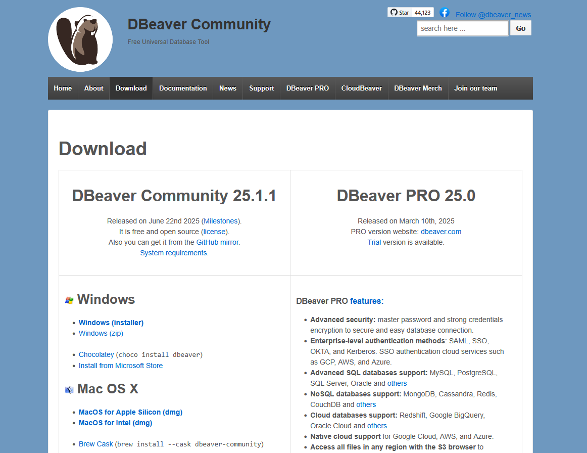

    
👋

    

        <h1 style="margin: 0; color: #333D47;">Введение</h1>
        
Подготовка к погружению в мир универсальных клиентов баз данных.

    

 

Добро пожаловать в курс по DBeaver! Этот инструмент станет вашим надежным помощником в мире баз данных. Наша цель — научиться использовать его максимально эффективно. Поехали! 🚀

## 📚 Теория

### Что такое DBeaver и зачем он нужен?

Представьте, что у вас есть ящик с инструментами. Для одного винта нужна крестовая отвертка, для другого — плоская, для третьего — шестигранник. Неудобно, правда? В мире баз данных часто бывает так же: для PostgreSQL есть свой инструмент, для MS SQL Server — свой, и так далее.

**DBeaver** — это **универсальный SQL-клиент**, ваш личный швейцарский нож. Он позволяет подключаться к огромному количеству разных баз данных и управлять ими из одного окна.

<blockquote style="background-color: #F8F9FA; border-left: 4px solid #3498DB; padding: 15px; margin: 20px 0; color: #333D47;">
    <b>Ключевая идея:</b> Один инструмент для работы с PostgreSQL, MS SQL Server, SQLite, MySQL, Oracle и десятками других СУБД. Это экономит ваше время и упрощает жизнь.
</blockquote>

### DBeaver vs. Специализированные инструменты

Конечно, существуют и "родные" клиенты для многих СУБД:
* `pgAdmin` для PostgreSQL
* `SQL Server Management Studio (SSMS)` для MS SQL Server

Они отлично справляются со своими задачами, но если вы работаете с несколькими СУБД одновременно (а в карьере разработчика это случается постоянно), DBeaver становится незаменимым помощником.

### Обзор версий: Community vs. Enterprise

У DBeaver есть несколько версий, но нас интересуют две:
1.  **Community Edition (CE):** Полностью бесплатная, с открытым исходным кодом.
2.  **Enterprise Edition (EE):** Платная, с расширенной поддержкой NoSQL баз данных (вроде MongoDB), специальными драйверами и дополнительными функциями.

<blockquote style="background-color: #F8F9FA; border-left: 4px solid #3498DB; padding: 15px; margin: 20px 0; color: #333D47;">
    ✨ В рамках этого курса мы будем использовать <b>DBeaver Community Edition</b>. Её возможностей более чем достаточно для всех учебных и большинства профессиональных задач.
</blockquote>

### Для кого это пособие?

Этот курс разработан для студентов IT-специальностей. Мы предполагаем, что у вас уже есть базовое представление о том, что такое SQL и реляционные базы данных.

### Как работать с этим курсом?

Каждая глава построена по простому принципу:
* **Теория** 📖: Читаем, разбираемся в концепциях.
* **Практика** 💻: Делаем вместе по шагам, закрепляя знания.
* **Самостоятельная работа** 🤔: Проверяем себя, выполняя небольшие задания.

---

## 💻 Практика

🎯 **Цель:** Подготовиться к установке DBeaver.

Давайте найдем, где живет наш будущий инструмент.

1.  Перейдите на официальный сайт **<a href="https://dbeaver.io/" target="_blank" style="color: #3498DB;">dbeaver.io</a>**.
2.  Найдите на главной странице раздел "Download" (Загрузка).
3.  Определите, какая версия вам понадобится для установки на ваш компьютер (Windows x86_64, macOS Apple Silicon/Intel, Linux DEB/RPM). **Скачивать пока ничего не нужно!**

 

    
    
<i>Кликните на изображение, чтобы перейти на сайт</i>

---

## 🤔 Самостоятельная работа

Проверьте себя! Нажмите на каждый вопрос, чтобы увидеть ответ.

  
Вопрос 1: Какое главное преимущество DBeaver перед pgAdmin или SSMS?

  
<b>Ответ:</b> Универсальность. DBeaver позволяет работать с множеством разных СУБД из одного приложения.

  
Вопрос 2: Какую версию DBeaver мы будем использовать в этом курсе?

  
<b>Ответ:</b> Бесплатную DBeaver Community Edition.

  
Вопрос 3: Из каких трех основных частей состоит каждая тема нашего пособия?

  
<b>Ответ:</b> Теория, Практика и Самостоятельная работа.

---

    <a href="01-first-steps/01-installation.md" style="background-color: #4CAF50; color: white; padding: 10px 20px; text-align: center; text-decoration: none; display: inline-block; font-size: 16px; margin: 4px 2px; cursor: pointer; border-radius: 8px; font-family: 'Segoe UI', 'Roboto', sans-serif; display: flex; align-items: center;">
        Вперед: Установка 
        ▶
    </a>

