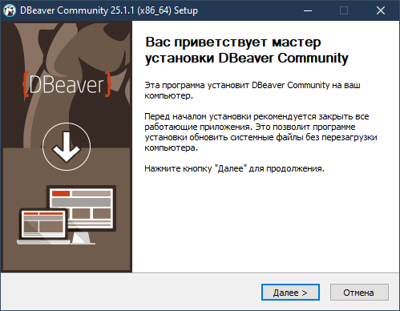
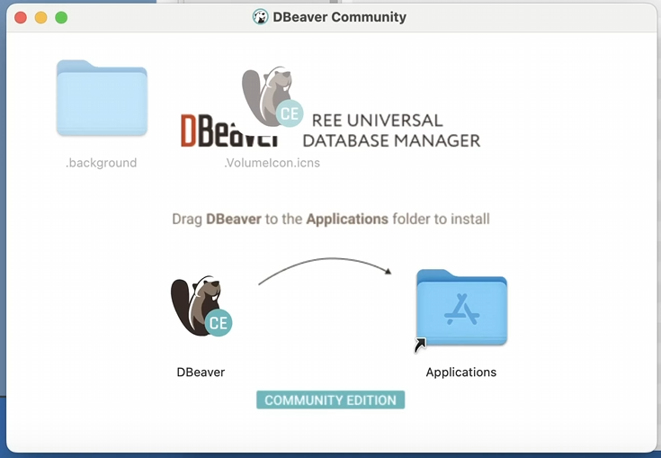
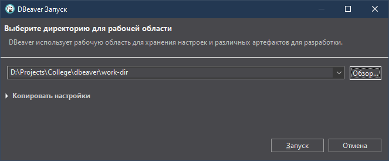

<div style="display: flex; align-items: center; background-color: white; padding: 25px; border-radius: 10px; box-shadow: 0 4px 12px rgba(0,0,0,0.08); border: 1px solid #EAECEE; font-family: 'Segoe UI', 'Roboto', sans-serif;">
  <div style="font-size: 4em; margin-right: 25px; user-select: none;">🚀</div>
  <div>
    <h1 style="margin: 0; color: #333D47;">Установка и первый запуск</h1>
    <p style="margin: 5px 0 0 0; font-size: 1.1em; color: #586069;">Скачиваем, устанавливаем и настраиваем рабочее пространство DBeaver.</p>
  </div>
</div>

<br>

## 📚 Теория

Прежде чем мы начнем творить магию с базами данных, нужно подготовить наш главный инструмент. В этой главе мы пройдем весь путь от скачивания до первого успешного запуска.

### Где скачать?

Единсственный надежный источник — **официальный сайт**. Мы уже заходили на него в прошлой главе.

* **Ссылка:** <a href="https://dbeaver.io/download/" target="_blank" style="color: #3498DB;">dbeaver.io/download/</a>

На странице загрузки вы увидите разные версии. Для Windows и macOS рекомендуется скачивать **Installer** — это установочный файл, который все сделает за вас.

<blockquote style="background-color: #F8F9FA; border-left: 4px solid #3498DB; padding: 15px; margin: 20px 0; color: #333D37;">
  <b>Installer vs. Archive:</b><br>
  <b>Installer (.exe, .dmg)</b> — классический установщик. Идеален для большинства пользователей.<br>
  <b>Archive (.zip, .tar.gz)</b> — портативная версия. Не требует установки, можно запустить с флешки. Мы будем использовать Installer.
</blockquote>

### Системные требования

DBeaver — довольно легковесное приложение. Вот основные требования:

* **Операционная система:** Windows 7+, macOS 10.13+, любая современная версия Linux.
* **Java:** DBeaver написан на Java, но **установщик уже включает в себя все необходимое (JRE)**. Вам не нужно устанавливать Java отдельно.
* **Оперативная память:** Рекомендуется от 2 ГБ, но комфортная работа начинается с 4 ГБ.
* **Место на диске:** Около 300-400 МБ для самого приложения.

### Процесс установки

Процесс немного отличается в зависимости от вашей ОС.

#### **Для Windows**

1. Запустите скачанный `.exe` файл.
2. Следуйте инструкциям мастера установки (в основном, нажимая "Далее").
3. На шаге выбора компонентов убедитесь, что выбрана ассоциация с `.sql` файлами. Это позволит открывать SQL-скрипты сразу в DBeaver.
4. Дождитесь окончания установки и нажите "Готово".

<p align="center">
  
</p>

#### **Для macOS**

1. Откройте скачанный `.dmg` файл.
2. В появившемся окне перетащите иконку DBeaver на иконку папки "Программы" (Applications).
3. При первом запуске macOS может показать предупреждение безопасности. Перейдите в `Системные настройки` → `Конфиденциальность и безопасность` и разрешите запуск приложения.

<p align="center">
    
</p>

#### **Для Linux (на примере Ubuntu/Debian)**

1.  Скачайте `.deb` пакет.
2.  Откройте терминал в папке с загруженным файлом.
3.  Выполните команду, подставив имя вашего файла:
    ```bash
    sudo dpkg -i dbeaver-ce_XX.X.X_amd64.deb
    ```
4.  Если появятся ошибки о неразрешенных зависимостях, выполните:
    ```bash
    sudo apt-get install -f
    ```

### Что такое "Рабочее пространство" (Workspace)?

При первом запуске DBeaver спросит вас о **рабочем пространстве**.

**Рабочее пространство** — это специальная папка на вашем компьютере, где DBeaver хранит всю свою "магию":

* Настройки всех ваших подключений к базам данных.
* Сохраненные SQL-скрипты и проекты.
* Историю ваших запросов.
* Настройки самого интерфейса.

> 💡 Вы можете создавать несколько рабочих пространств для разных целей. Например, одно для учебы, другое — для личных проектов. Это помогает не смешивать все в одну кучу.

<p align="center">
    
</p>

---

## 💻 Практика

🎯 **Цель:** Установить DBeaver и создать свое первое, персональное рабочее пространство.

1.  **Скачайте** установочный файл DBeaver Community Edition с [официального сайта](https://dbeaver.io/download/).
2.  **Установите** приложение, следуя инструкциям для вашей операционной системы из раздела "Теория".
3.  **Запустите** DBeaver. Появится окно "Выбор рабочего пространства".
4.  **Не используйте путь по умолчанию!** Нажмите кнопку "Обзор..." (`Browse...`).
5.  Создайте новую папку в удобном для вас месте (например, в `Документах`) по формату `ГРУППА-ФАМИЛИЯ_ИМЯ`. Например: `ИСП-21-Иванов_Иван`.
6.  **Выберите** эту созданную папку и нажмите "Запустить" (`Launch`).
7.  Поздравляем! 🎉 Перед вами чистый интерфейс DBeaver, готовый к работе.

---

## 🤔 Самостоятельная работа

<style>
    details { margin-bottom: 10px; border-radius: 8px; }
    details > summary { padding: 15px; cursor: pointer; font-weight: bold; background-color: #F8F9FA; }
    details > p { padding: 15px; margin: 0; border-top: 1px solid #EAECEE; }
</style>

<details>
  <summary><b>Вопрос:</b> Где DBeaver предлагает хранить файлы рабочего пространства по умолчанию на вашей операционной системе?</summary>
  <p><b>Ответ:</b> Путь по умолчанию зависит от ОС и обычно выглядит так:<br>
  <ul>
    <li><b>Windows:</b> <code>C:\Users\ИМЯ_ПОЛЬЗОВАТЕЛЯ\AppData\Roaming\DBeaverData\workspace6</code></li>
    <li><b>macOS:</b> <code>/Users/ИМЯ_ПОЛЬЗОВАТЕЛЯ/Library/DBeaverData/workspace6</code></li>
    <li><b>Linux:</b> <code>/home/ИМЯ_ПОЛЬЗОВАТЕЛЯ/.local/share/DBeaverData/workspace6</code></li>
  </ul>
  Именно поэтому мы создаем свою папку в более удобном месте!
  </p>
</details>

---

<div style="display: flex; justify-content: space-between; align-items: center; margin-top: 30px; font-family: 'Segoe UI', 'Roboto', sans-serif;">
    <a href="../00-introduction.md" style="background-color: #6c757d; color: white; padding: 10px 20px; text-align: center; text-decoration: none; display: inline-block; font-size: 16px; margin: 4px 2px; cursor: pointer; border-radius: 8px; display: flex; align-items: center;">
        <span style="font-size: 24px; margin-right: 10px; line-height: 1;">◀</span>
        <span>Назад: Введение</span> 
    </a>
    <a href="02-ui-overview.md" style="background-color: #4CAF50; color: white; padding: 10px 20px; text-align: center; text-decoration: none; display: inline-block; font-size: 16px; margin: 4px 2px; cursor: pointer; border-radius: 8px; display: flex; align-items: center;">
        <span>Вперед: Обзор интерфейса</span> 
        <span style="font-size: 24px; margin-left: 10px; line-height: 1;">▶</span>
    </a>
</div>